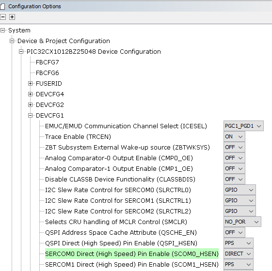

#  UART -- Hello World

[Getting Started](../../readme.md)

[Getting Started with Peripheral Building Blocks](../../peripheral/readme.md)

[Getting Started with Central Building Blocks](../../central/readme.md)

BLE Peripheral Developers: [FreeRTOS and BLE Stack Setup](../../peripheral/freertos_ble_stack_init_peripheral.md) **-->** [Adding UART](readme.md) **-->** [Legacy Advertisements](../../peripheral/legacy_adv_sleep/readme.md)

BLE Central Developers: [FreeRTOS and BLE Stack Setup](../../central/freertos_ble_stack_init_central.md) **-->** [Adding UART](readme.md) **-->** [Legacy Scan](../../central/legacy_scan/readme.md)

## Introduction

This document will help users to enable UART functionality on WBZ451
Curiosity board using MPLAB Code Configurator

Users of this document can choose to just run the precompiled
Application Example hex on the WBZ451 Curiosity Board and experience the
demo or can go through the steps involved in enabling UART from
scratch using MPLAB Code Configurator

## Recommended Reads

1.  [FreeRtos BLE App Initialize (Peripheral)](../../peripheral/freertos_ble_stack_init_peripheral.md)

2.  [FreeRtos BLE App Initialize (Central)](../../central/freertos_ble_stack_init_central.md)

## Hardware Required

  |**Tool**                | **Qty**  |
  |------------------------| ---------|
  |WBZ451 Curiosity Board  | 1        |
  |Micro USB cable         | 1        |

## SDK Setup
1.  [SDK Setup](../../../../docs/pic32cx_bz2_wbz45x_sdk_setup.md)

## Software
1.  [TeraTerm](https://ttssh2.osdn.jp/index.html.en)

## Programming the precompiled hex file or Application Example

### Programming the hex file using MPLABX IPE

1.  Precompiled Hex file is located <a href="hex/"> here </a>

2.  Follow the steps mentioned [here](https://microchipdeveloper.com/ipe:programming-device)

 **Caution:** Users should choose the correct Device and Tool information

### Programming the Application using MPLABX IDE

1.  Follow steps mentioned in section 4 of [SDK Setup document](../../../../docs/pic32cx_bz2_wbz45x_sdk_setup.md)

2.  Open and program the Application Example <a href="firmware"> uart_hello_world </a>  in MPLABX IDE

## Demo Description

This Application Example enables users to print data over a terminal
emulator like TeraTerm

## Testing
Connect the WBZ451 Curiosity board to PC, program the application example. Open Terarerm(Speed: 115200, Data: 8-bit, Parity: none, stop
bits: 1 bit, Flow control: none) and select the COM port that is enumerated when connecting the WBZ451 Curiosity Board. Reset the board and  Demo will print "Hello World"

## Developing this Application from scratch using MPLAB Code Configurator

This section explains the steps required by a user to develop this application example from scratch using MPLABx Code Configurator

**Tip:** New users of MPLAB Code Configurator are recommended to go through the [overview](https://onlinedocs.microchip.com/pr/GUID-1F7007B8-9A46-4D03-AEED-650357BA760D-en-US-6/index.html?GUID-B5D058F5-1D0B-4720-8649-ACE5C0EEE2C0).

1.  Create a new MCC Harmony Project -- [link](../../../../docs/creating_new_mplabx_harmony_project.md) for
    instructions

2.  Import component configuration -- This step helps users
    setup the basic components required to start their
    Application Development
    component configuration related to this Application is
    available [here](firmware/uart_hello_world_wbz451.X/uart_hello_world_wbz451.mc3) 
    Users should follow the instructions mentioned
    [here](https://microchipdeveloper.com/mcc:peripheralconfig) to import the component configuration.

    **Tip:** Import and Export functionality of component configuration will help users to start from a known working setup of configuration

3.  Accept Dependencies or satisfiers, select "Yes"

4.  Verify if the Project Graph window has all the expected configuration

    

## Verify UART Configuration
1.  Select **SERCOM0** component in project graph

    

2.  Select **system** component in project graph

    

## Generate Code [link](../../../../docs/generate_code.md) for instructions

## Files and Routines Automatically generated by the MCC
After generating the program source from MCC interface by clicking Generate Code, the peripheral libraries (PLIBs) configuration can be found in the following project directories

The sercom initialization routine executed during program initialization can be found in the project files. This initialization routine is automatically generated by the MCC according to the user settings

### Header Files

-   Header File associated with the sercom0 peripheral library or any
    other peripheral library for a different example is included in
    definitions.h file

**Tip:** To use all the SERCOM0 functionality include the definitions.h
file in Application code

### Function Calls

MCC generates and adds the code to initialize the UART peripheral
in *SYS_Initialize()* function

-   SERCOM0_USART_Initialize() is the API that will be called inside the
    SYS_Initialize() function

## User Application Development

### Include

-   definitions.h in app.c (definitions.h is called to include the peripheral.h files)
-   app_idle_task.h in app.c

### Transfer Data using UART
 -   Add app_idle_task() in the function vApplicationIdleHook() in freertos_hooks.c

-   SERCOM0_USART_Write() is the used to submit a write buffer to the given USART       peripheral to transfer data, user can call this API in APP_STATE_INIT:

Users can exercise various other UART/SERCOM functionalities by using
the peripheral library [documentation](https://microchip-mplab-harmony.github.io/csp/frames.html?frmname=topic&frmfile=05544.html)

## Where to go from here

-   Central role [BLE Scanner](../../central/legacy_scan/readme.md)

-   Peripheral Role [BLE Advertisements](../../peripheral/legacy_adv_sleep/readme.md)

-   Peripheral Role [BLE Extended Advertisements (sleep)](../../peripheral/ext_adv/readme.md)
