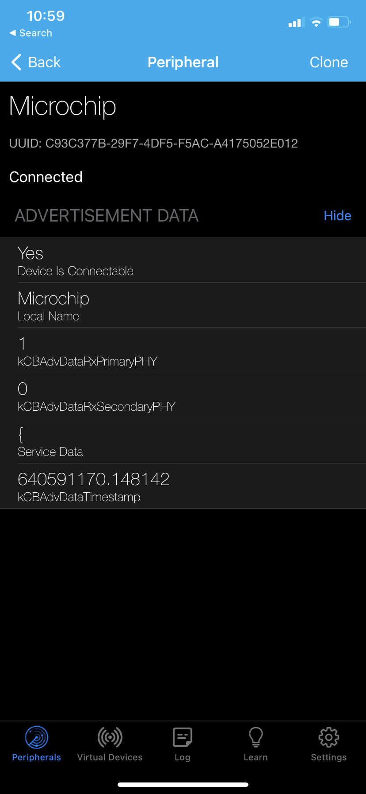
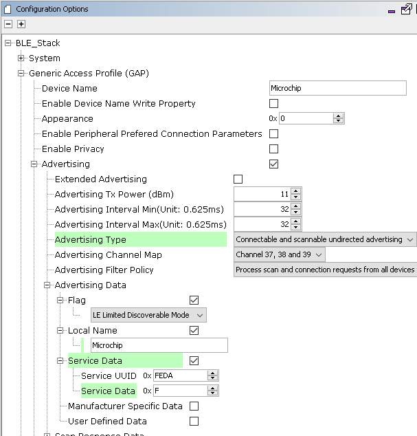
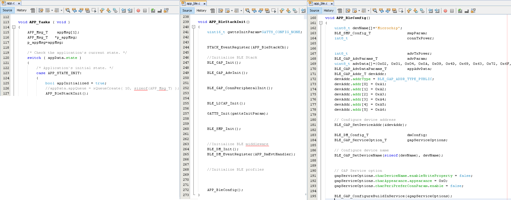
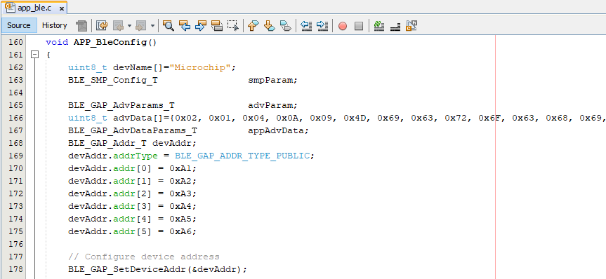

[](https://www.microchip.com)
#  BLE Connection(Peripheral)

[Getting Started](../../readme.md)

[Getting Started with Peripheral Building Blocks](../../peripheral/readme.md)

[Legacy Advertisements](../legacy_adv_sleep/readme.md) **-->** [BLE Connection](readme.md) **-->** [Profiles and Services](../profiles_services/readme.md)

## Introduction

This document will help users enable advertisements and connection on WBZ451 Curiosity board using MPLAB Code Configurator(MCC) BLE Advertisement is Broadcasting of small packets to peer devices. In BLE a peripheral device always starts with advertisements.Advertisement packets enable a central or observer to discover and connect to a peripheral.

Users of this document can choose to just run the precompiled
Application Example hex file on the WBZ451 Curiosity Board and
experience the demo or can go through the steps involved in developing
this Application from scratch

## Recommended Reads

1.  [FreeRtos BLE App Initialize](../freertos_ble_stack_init_peripheral.md)

2.  [BLE Legacy Advertisements](../legacy_adv_sleep/readme.md)

## Hardware Required

  |**Tool**                | **Qty**  |
  |------------------------| ---------|
  |WBZ451 Curiosity Board  | 1        |
  |Micro USB cable         | 1        |

## SDK Setup

1.  [SDK Setup](../../../../docs/pic32cx_bz2_wbz45x_sdk_setup.md)

## Software

1.  [TeraTerm](https://ttssh2.osdn.jp/index.html.en)

## Smartphone App

1.  Light Blue

## Programming the precompiled hex file or Application Example

### Programming the hex file using MPLABX IPE

1.  Precompiled Hex file is located <a href="hex/"> here </a>

2.  Follow the steps mentioned [here](https://microchipdeveloper.com/ipe:programming-device)

 **Caution:** Users should choose the correct Device and Tool information
### Programming the Application using MPLABX IDE

1.  Follow steps mentioned in section 4 of [SDK Setup document](../../../../docs/pic32cx_bz2_wbz45x_sdk_setup.md)

2.  Open and program the Application Example <a href="firmware"> peripheral_connection </a>  in MPLABX IDE

## Demo Description

This Application Example enables users to transmit Connectable and Scannable Undirected BLE Advertisements.On reset demo will print "Advertising" on a terminal emulator like TeraTerm, this denotes start of advertisements. Central device scanning these advertisements can issue connection request and get connected with this device. Upon connection demo prints "Connected" message on terminal window

## Testing

Connect the WBZ45x Curiosity board to PC, program the precompiled hex
file or application example as mentioned. Open TeraTerm @ (Speed:
115200, Data: 8-bit, Parity: none, stop bits: 1 bit, Flow control:
none). Reset the board. Upon reset, "Advertising" message is displayed
on the TeraTerm. User can open the LightBlue App on Smartphone to scan
for Advertisements. Device with device name "Microchip" will appear.

Select the device to get connected, after successful connection user can view the advertisement data.

Terminal output


Users can use another WBZ451 Curiosity Board configured as [BLE Connection(central)](../../central/connection/readme.md) instead of using a Smartphone App

## Developing this Application from scratch using MPLAB Code Configurator

This section explains the steps required by a user to develop this application example from scratch using MPLABx Code Configurator

**Tip:** New users of MPLAB Code Configurator are recommended to go through the [overview](https://onlinedocs.microchip.com/pr/GUID-1F7007B8-9A46-4D03-AEED-650357BA760D-en-US-6/index.html?GUID-B5D058F5-1D0B-4720-8649-ACE5C0EEE2C0).

1.  Create a new MCC Harmony Project -- [link](../../../../docs/creating_new_mplabx_harmony_project.md) for
    instructions

2.  Import component configuration -- This step helps users
    setup the basic components required to start their
    Application Development component configuration related to this Application is
    available [here](firmware/peripheral_conn_wbz451_curiosity.X/peripheral_conn_wbz451_curiosity.mc3)    
    Users should follow the instructions mentioned
    [here](https://microchipdeveloper.com/mcc:peripheralconfig) to import the component configuration.

    **Tip:** Import and Export functionality of component configuration will help users to start from a known working setup of configuration

3.  Accept Dependencies or satisfiers, select "Yes"

4.  Verify if the Project Graph window has all the expected configuration
    

## Verify Advertisement and Connection Configuration
1. Select **BLE_Stack** component in project graph
    

## Generate Code [link](../../../../docs/generate_code.md) for instructions

## Files and Routines Automatically generated by the MCC
After generating the program source from MCC interface by clicking Generate Code, the BLE configuration can be found in the following project directories


The [OSAL](http://ww1.microchip.com/downloads/en/DeviceDoc/MPLAB%20Harmony%20OSAL%20Libraries%20Help%20v2.06.pdf), RF System, BLE System  initialization routine executed during program initialization can be found in the project files. This initialization routine is automatically generated by the MCC


The BLE stack initialization routine excuted during Application Initialization can be found in project files. This intitialization routine is automatically generated by the MCC. This call initializes and configures the GAP, GATT, SMP, L2CAP and BLE middleware layers.


Autogenerated, advertisement data format


  |**Source Files**        | **Usage**  |
  |------------------------|------------|
  |app.c                   |Application State machine, includes calls for Initialization of all BLE stack (GAP,GATT, SMP, L2CAP) related componenet configurations            |
  |app_ble.c               |Source Code for the BLE stack related componenet configurations, code related to function calls from app.c                                        |
  |app_ble_handler.c       |All GAP, GATT, SMP and L2CAP Event handlers   

> **Tip:** app.c is autogenerated and has a state machine based
> Application code sample, users can use this template to develop their
> application                                                                                                    |
### Header Files

-   ble_gap.h- This header file contains BLE GAP functions and is
    automatically included in the app.c file

### Function Calls

MCC generates and adds the code to initialize the BLE Stack GAP,
GATT, L2CAP and SMP in *APP_BleStackInit()* function

-   APP_BleStackInit() is the API that will be called inside the
    Applications Initial State -- APP_STATE_INIT in app.c

## User Application Development

### Include

-   user action is required as mentioned [here](../../../../docs/user_action.md)
-   definitions.h in all the files where UART will be used to print debug information
>Tip: definitions.h is not specific to just UART peripheral, instead it should be included in all application source files where peripheral functionality will be exercised


### Set PUBLIC Device Address

-   BLE_GAP_SetDeviceAddr(&devAddr);
```
    BLE_GAP_Addr_T devAddr;
    devAddr.addrType = BLE_GAP_ADDR_TYPE_PUBLIC;
    devAddr.addr[0] = 0xA1;
    devAddr.addr[1] = 0xA2;
    devAddr.addr[2] = 0xA3;
    devAddr.addr[3] = 0xA4;
    devAddr.addr[4] = 0xA5;
    devAddr.addr[5] = 0xA6;

    // Configure device address
    BLE_GAP_SetDeviceAddr(&devAddr);
```




### Start Advertisement

-   BLE_GAP_SetAdvEnable(0x01, 0);


### Connected & Disconnected Events

-   All the possible GAP, GATT, SMP and L2CAP Event handlers are available in file app_ble_handler.c, users can implement application code to denote Connection State here.

    

Users can exercise various other BLE Advertisement functionalities by
using [BLE Stack API](../../docs/api/driver/ble/docs/html/modules.html)

## Where to go from here

-   [BLE Profiles and Services](../profiles_services/readme.md)
